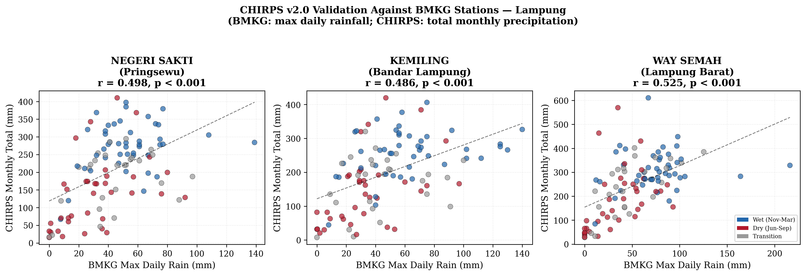
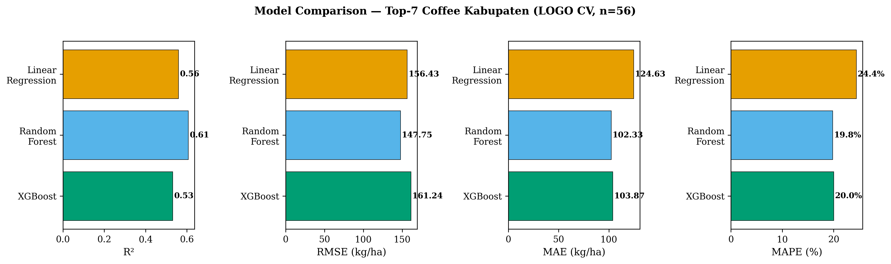
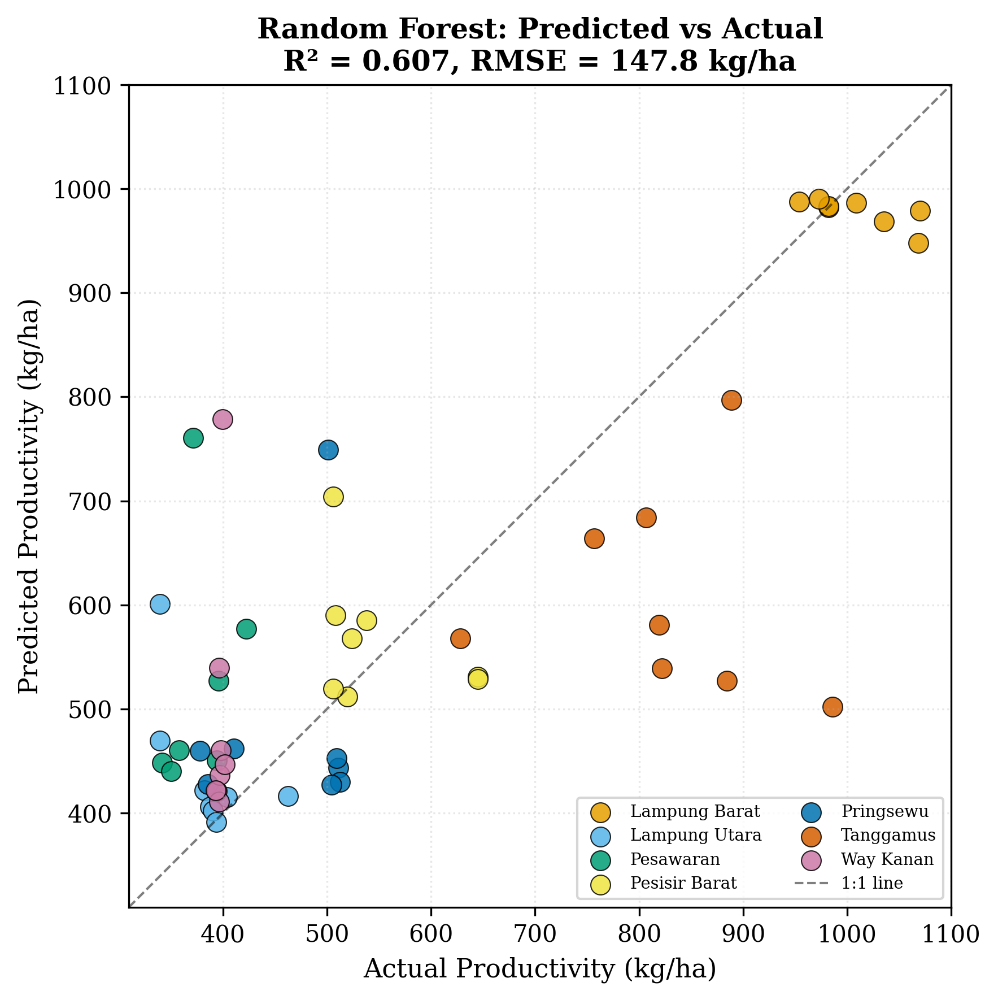
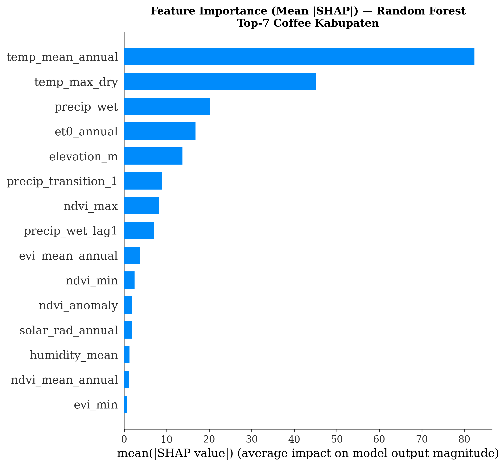
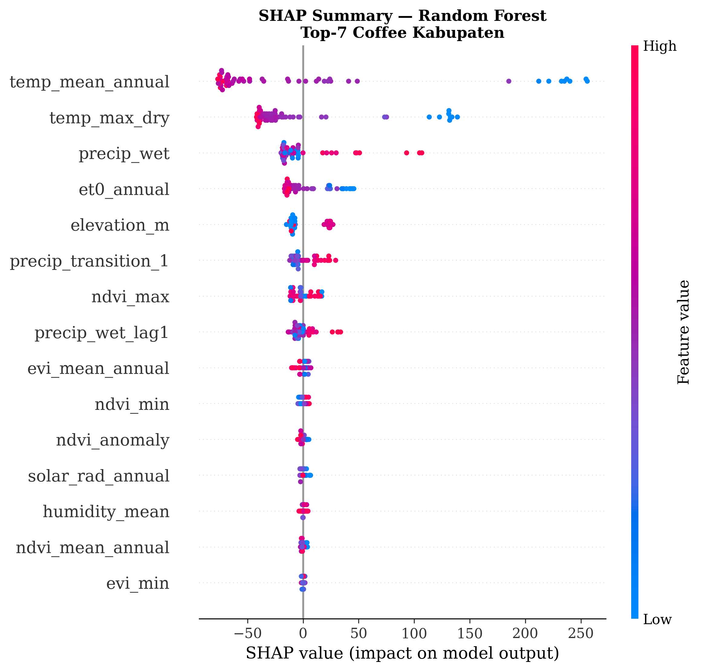
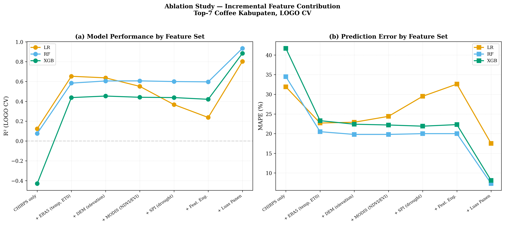
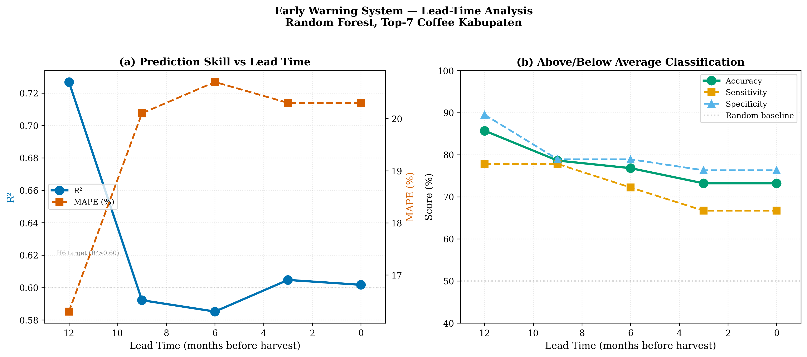

# Climate-Driven Robusta Coffee Yield Prediction in Lampung, Indonesia: A Machine Learning Approach Using CHIRPS Satellite Precipitation Data

**Authors:** [To be determined]

**Target Journal:** International Journal of Climatology / Remote Sensing (MDPI)

**Status:** Complete First Draft — All Sections

---

## Abstract

*[To be written last, after all results are finalized]*

---

## 1. Introduction

Coffee is one of the most economically important agricultural commodities worldwide, with Indonesia ranking as the fourth-largest producer globally. Within Indonesia, Lampung Province serves as the second-largest Robusta coffee producing region, contributing approximately 15% of national coffee output with an annual production exceeding 110,000 tons from roughly 155,000 hectares of plantation area (BPS, 2023). The province's coffee sector supports the livelihoods of hundreds of thousands of smallholder farmers and plays a central role in the regional economy.

Robusta coffee (*Coffea canephora*) is a perennial crop with a biennial bearing cycle, making it particularly sensitive to inter-annual climate variability. Unlike annual crops that complete their reproductive cycle within a single growing season, coffee requires 9–11 months from flowering to fruit maturation, meaning that climate conditions during critical phenological stages can have delayed and compounding effects on yield. In Lampung's tropical monsoon climate, the dry season (June–September) triggers flower bud differentiation, with the onset of rains initiating synchronized flowering — a mechanism that renders coffee productivity highly dependent on the timing, duration, and intensity of seasonal precipitation patterns.

Recent studies have demonstrated that climate change poses a significant threat to coffee production in Indonesia. Sarvina et al. (2023) projected that the area with highly suitable climate for Robusta coffee in Lampung would decrease from 1.63% to 0.56% by 2050 under the RCP 2.6 scenario. Furthermore, El Niño–Southern Oscillation (ENSO) events have been associated with substantial production losses — Indonesian coffee output declined by approximately 20% during the 2023–2024 El Niño episode, with lowland areas in Sumatra experiencing severe heat and drought stress. The Indian Ocean Dipole (IOD) can amplify these effects when co-occurring with El Niño, further reducing rainfall across Lampung's coffee-growing districts.

Despite the clear climate sensitivity of Robusta coffee in Lampung, quantitative tools for predicting yield based on climate data remain underdeveloped. Existing climate-coffee studies in the region have focused primarily on suitability mapping using the Maxent approach (Sarvina et al., 2022, 2023), which assesses where coffee can grow rather than how much it will produce. Statistical analyses of weather impacts on Robusta yield have been conducted in Vietnam (Dinh et al., 2022) and Brazil (Aparecido et al., 2022), but not for Indonesian production systems. A recent study by Aprilia et al. (2025) applied Random Forest to predict coffee production in Lampung using NASA POWER meteorological data, achieving an R² of 0.85. However, this study was limited to a single model without feature importance analysis, drought indices, or climate teleconnection predictors, and employed NASA POWER data at a relatively coarse spatial resolution of 0.5°.

Satellite-based precipitation products offer a promising alternative to sparse gauge networks for climate-agricultural studies in data-limited regions. The Climate Hazards Group InfraRed Precipitation with Stations (CHIRPS) dataset (Funk et al., 2015) provides quasi-global precipitation estimates at 0.05° (~5 km) spatial resolution from 1981 to near-present, combining satellite infrared observations with in-situ station data. CHIRPS has been validated across Indonesia with generally high reliability at the monthly scale (correlation coefficient > 0.7, relative bias < ±25%) (Marzuki et al., 2025), and a specific validation in South Lampung reported a probability of detection of 0.86 during the wet season (Pratama and Agiel, 2022). The high spatial resolution and long temporal record of CHIRPS make it particularly suitable for capturing precipitation variability across Lampung's topographically diverse coffee-growing districts, which range from coastal lowlands to the Bukit Barisan highlands.

Machine learning (ML) approaches have demonstrated considerable potential for crop yield prediction by capturing nonlinear relationships between climate variables and agricultural productivity. Random Forest and XGBoost have consistently emerged as top-performing models for tabular agricultural data, with reported R² values of 0.70–0.93 in coffee yield studies (Aparecido et al., 2022; Kouadio et al., 2021). SHapley Additive exPlanations (SHAP) analysis has become the standard method for interpreting ML predictions, enabling identification of key climate drivers and their directional effects on yield. Importantly, Meroni et al. (2021) demonstrated that ML models can outperform benchmarks for crop yield prediction even with limited sample sizes, provided that appropriate model selection, regularization, and validation strategies are employed.

This study addresses the following research questions:

1. How accurately does CHIRPS v2.0 represent precipitation patterns in Lampung's coffee-growing regions compared to BMKG gauge stations?
2. Which precipitation-derived variables exhibit the strongest influence on inter-annual variability of Robusta coffee productivity in Lampung?
3. Which machine learning approach provides the most accurate and robust prediction of Robusta coffee productivity using satellite-derived climate features?
4. Can the best-performing model serve as a seasonal early warning tool for coffee productivity decline?

This study makes three contributions. First, it provides the first validation of CHIRPS against gauge data specifically for Lampung's coffee-growing districts — prior validations in Indonesia focused on Java and Kalimantan. Second, it presents the first ML-based coffee yield prediction for Indonesia using satellite precipitation, advancing beyond the single-model NASA POWER approach of Aprilia et al. (2025) with higher spatial resolution data, multiple model comparison, drought indices, and SHAP-based interpretability. Third, it identifies critical precipitation windows for Lampung Robusta coffee through interpretable ML, providing actionable insights for farmers and policymakers facing increasing climate variability.

---

## 2. Study Area and Data

### 2.1 Study Area

Lampung Province is located at the southern tip of Sumatra Island, Indonesia, spanning approximately 103.5°E–106.0°E longitude and 3.5°S–6.0°S latitude (Fig. 1). The province covers an area of approximately 34,624 km² and is bordered by the Sunda Strait to the south, the Java Sea to the east, and the provinces of South Sumatra and Bengkulu to the north and west, respectively.

The topography of Lampung is characterized by a pronounced west-to-east gradient, with the Bukit Barisan mountain range occupying the western portion of the province (elevations exceeding 2,000 m above sea level in Pesisir Barat and Lampung Barat districts) and gradually descending to lowland plains and coastal areas in the east. This topographic diversity creates distinct microclimatic zones that influence the spatial distribution of coffee cultivation.

Lampung experiences a tropical monsoon climate (Köppen type Am) with a distinct wet season (November–March) and dry season (June–September), separated by transitional periods in April–May and October. Mean annual precipitation ranges from approximately 2,000 mm in the eastern lowlands to over 3,000 mm in the western highlands. Mean annual temperature ranges from 26–28°C in the lowlands to 20–24°C in the highlands.

Robusta coffee cultivation in Lampung is concentrated in five major producing districts: Lampung Barat (54,106 ha, 34.5% of provincial coffee area), Tanggamus (41,510 ha), Lampung Utara (25,679 ha), Way Kanan (21,655 ha), and Pesisir Barat (6,704 ha). Together, these five districts account for over 95% of the province's coffee plantation area of approximately 156,000 ha (Dinas Perkebunan Lampung, 2020). Coffee is predominantly grown by smallholder farmers at elevations between 200 and 800 m above sea level, with Lampung Barat serving as the primary production center, contributing approximately 50% of provincial coffee output.

### 2.2 Data Sources

#### 2.2.1 CHIRPS Precipitation Data

Monthly precipitation data were obtained from the Climate Hazards Group InfraRed Precipitation with Stations version 2.0 (CHIRPS v2.0) dataset (Funk et al., 2015). CHIRPS provides quasi-global (50°S–50°N) gridded precipitation estimates at 0.05° (~5 km) spatial resolution and daily to monthly temporal resolution, spanning from 1981 to near-present. The dataset blends satellite-based infrared cold cloud duration estimates with in-situ station observations using a modified inverse distance weighting algorithm. Monthly CHIRPS GeoTIFF files were downloaded from the Climate Hazards Center data server (https://data.chc.ucsb.edu/products/CHIRPS-2.0/) and clipped to the Lampung bounding box (103.5°E–106.0°E, 3.5°S–6.0°S). Data from 1981–2023 were used for SPI baseline computation, with the study period analysis focused on 2010–2023.

#### 2.2.2 Coffee Production Data

Annual Robusta coffee production statistics (harvested area in hectares, production in tons, and productivity in kg/ha) were obtained from the Badan Pusat Statistik (BPS) Lampung Province for the period 2010–2023. Provincial-level aggregate data were supplemented with per-district data from the Dinas Perkebunan (Plantation Office) of Lampung Province. Productivity (kg/ha), computed as production divided by harvested area, was used as the target variable for the prediction models.

#### 2.2.3 Climate Indices

Monthly ENSO indices (Oceanic Niño Index, ONI, based on the Niño 3.4 region sea surface temperature anomaly) were obtained from the NOAA Climate Prediction Center (https://www.cpc.ncep.noaa.gov/). Monthly Indian Ocean Dipole Mode Index (DMI) values were obtained from the NOAA Physical Sciences Laboratory (https://psl.noaa.gov/). Both indices were aggregated to annual means and seasonal averages for use as predictors.

#### 2.2.4 ERA5 Reanalysis Data

Monthly averaged ERA5 reanalysis data were obtained from the Copernicus Climate Data Store for the period 2010–2023 at 0.25° (~25 km) spatial resolution. Five variables were extracted: 2-meter temperature, 2-meter dewpoint temperature, total precipitation, potential evaporation, and surface solar radiation downwards. Relative humidity was derived from temperature and dewpoint using the Magnus formula. Data were spatially extracted at each district centroid.

#### 2.2.5 MODIS Vegetation Indices

MODIS Terra Vegetation Indices (MOD13Q1, Collection 6.1) were obtained from the NASA ORNL DAAC TESViS web service at 250 m spatial resolution and 16-day temporal resolution for the period 2010–2023. Both Normalized Difference Vegetation Index (NDVI) and Enhanced Vegetation Index (EVI) were extracted at each district centroid and aggregated to monthly means. Annual features (mean, minimum, maximum, standard deviation, and anomaly) were computed for use in the prediction models.

#### 2.2.6 Digital Elevation Model

Elevation data were obtained from the Shuttle Radar Topography Mission (SRTM) Global 30-meter dataset via the OpenTopoData API. Mean elevation was extracted at each district centroid within an approximately 5 km radius. Elevation ranged from 7 m (Bandar Lampung, Tulang Bawang Barat) to 1,180 m (Pesawaran) across the 15 districts.

### 2.3 Data Summary

Table 1 summarizes all datasets used in this study.

| Dataset | Source | Variables | Spatial Resolution | Temporal Resolution | Period | Access |
|---------|--------|-----------|-------------------|--------------------|---------| ------|
| CHIRPS v2.0 | CHC UCSB | Precipitation (mm) | 0.05° (~5 km) | Monthly | 1981–2023 | Open |
| BPS Coffee Production | BPS Lampung | Area (ha), production (ton), productivity (kg/ha) | Provincial / district | Annual | 2010–2023 | Open |
| ENSO ONI | NOAA CPC | Niño 3.4 SST anomaly (°C) | Global index | Monthly | 1950–2025 | Open |
| IOD DMI | NOAA PSL | Dipole Mode Index (°C) | Global index | Monthly | 1870–2025 | Open |
| ERA5 | Copernicus CDS | Temperature, humidity, ET₀ | 0.25° (~25 km) | Monthly | 2010–2023 | Open |
| MODIS (MOD13Q1) | NASA ORNL DAAC | NDVI, EVI | 250 m | 16-day | 2010–2023 | Open |
| DEM | USGS/BIG | Elevation (m) | 30 m | Static | — | Open |

---

## 3. Methodology

### 3.1 Overview

The methodological framework comprises four stages: (1) CHIRPS validation against gauge stations, (2) feature engineering from multi-source climate data, (3) ML model training and comparison, and (4) interpretability analysis and early warning framework development (Fig. 2). All analyses were conducted in Python 3.9 using scikit-learn, XGBoost, and SHAP libraries. A random seed of 42 was used throughout for reproducibility.

### 3.2 CHIRPS Validation

CHIRPS v2.0 monthly precipitation was validated against available BMKG rain gauge stations in Lampung for the period 2010–2023. For each station, the nearest CHIRPS grid cell was extracted and compared at the monthly scale. The following metrics were computed:

- **Pearson correlation coefficient (r)**: measures the linear association between CHIRPS and gauge data
- **Relative bias (%)**: systematic overestimation or underestimation, computed as (CHIRPS − gauge) / gauge × 100
- **Root mean square error (RMSE)**: overall magnitude of errors (mm/month)
- **Probability of Detection (POD)**: proportion of observed rain events correctly detected by CHIRPS
- **False Alarm Ratio (FAR)**: proportion of CHIRPS rain events not observed at the gauge

A rain/no-rain threshold of 1 mm/month was applied for categorical metrics.

### 3.3 Feature Engineering

Monthly CHIRPS data were spatially averaged for each coffee-producing district and temporally aggregated into the following feature groups:

**Precipitation features:**

- Total annual precipitation (mm)
- Seasonal totals: wet season (November–March), dry season (June–September), transition periods (April–May, October)
- Phenologically relevant periods: flowering phase (June–August), fruiting phase (September–November)
- Coefficient of variation (CV) of monthly precipitation within each year
- Number of wet months (precipitation > 100 mm)
- Previous year's annual and dry-season precipitation (lag-1 features)

**Drought indices:**

The Standardized Precipitation Index (SPI) was computed at 3-, 6-, and 12-month accumulation periods following the gamma distribution fitting approach of McKee et al. (1993). The baseline period 1981–2023 was used for parameter estimation. SPI values at the end of key phenological stages were extracted as features.

**Climate teleconnection indices:**

Annual mean and seasonal values of the Oceanic Niño Index (ONI) and Dipole Mode Index (DMI) were included to capture the influence of ENSO and IOD on local precipitation and coffee productivity.

**ERA5-derived features:**

- Mean annual temperature (°C) and maximum dry-season temperature (°C)
- Annual potential evapotranspiration (ET₀, mm)
- Mean relative humidity (%)
- Annual surface solar radiation (MJ/m²)
- Climatic water deficit (ET₀ − precipitation, mm)

**MODIS-derived features:**

- Mean annual NDVI and EVI
- Minimum NDVI and EVI (stress indicators)
- Maximum NDVI and NDVI standard deviation
- NDVI anomaly relative to the 2010–2023 long-term mean

**Topographic and management features:**

- Mean elevation (m asl) per district from SRTM DEM
- Harvested area (ha) as a proxy for management intensity

### 3.4 Machine Learning Models

Four regression models were evaluated, selected to span a range of complexities and learning paradigms suitable for small-sample settings (~14 provincial-level observations or ~70 district-level observations):

1. **Multiple Linear Regression (MLR)**: serves as the baseline model, assuming linear relationships between features and productivity.

2. **Random Forest (RF)**: an ensemble bagging method that constructs multiple decision trees on bootstrapped subsets. RF is robust to overfitting with small datasets due to its inherent averaging mechanism. Default configuration: 200 trees, maximum depth of 10, minimum 5 samples per leaf.

3. **Extreme Gradient Boosting (XGBoost)**: a regularized gradient boosting framework that builds trees sequentially, correcting errors of previous trees. XGBoost incorporates L1 and L2 regularization to mitigate overfitting. Default configuration: 200 boosting rounds, maximum depth of 5, learning rate of 0.1, L1 regularization (alpha) of 0.1.

4. **Support Vector Regression (SVR)**: a kernel-based method that finds the optimal hyperplane within an epsilon-insensitive tube. SVR is particularly suited for small sample sizes. A radial basis function (RBF) kernel was used with C = 10 and epsilon = 0.1. Features were standardized to zero mean and unit variance before SVR training.

### 3.5 Validation Strategy

Given the limited sample size and temporal structure of the data, Leave-One-Year-Out (LOYO) cross-validation was employed as the primary validation strategy. In each fold, data from one year were held out for testing while all remaining years were used for training. This approach respects the temporal ordering of the data and provides an unbiased estimate of prediction performance for unseen years.

For hyperparameter tuning, grid search was conducted within the LOYO cross-validation framework, with the mean R² across folds as the selection criterion.

A final hold-out test was reserved for the period 2021–2023 (3 years), with models developed exclusively on 2010–2020 data. This final evaluation was conducted exactly once to avoid data leakage and provide an independent estimate of generalization performance.

### 3.6 Evaluation Metrics

Model performance was assessed using four complementary metrics:

- **Coefficient of determination (R²)**: proportion of variance in productivity explained by the model. Target: R² > 0.70.
- **Root mean square error (RMSE)**: average magnitude of prediction errors in kg/ha.
- **Mean absolute error (MAE)**: average absolute deviation in kg/ha.
- **Mean absolute percentage error (MAPE)**: relative prediction error as a percentage of actual productivity. Target: MAPE < 15%.

### 3.7 Feature Importance and Interpretability

SHapley Additive exPlanations (SHAP) values were computed for the best-performing model to quantify the contribution of each feature to individual predictions. SHAP provides a unified measure of feature importance that is consistent, locally accurate, and based on cooperative game theory. Summary plots, dependence plots, and mean absolute SHAP values were used to identify the most influential climate drivers and their directional effects on coffee productivity.

### 3.8 Ablation Study

To assess the incremental contribution of different data sources, an ablation study was conducted by progressively adding feature groups:

1. CHIRPS precipitation features only
2. CHIRPS + ERA5 temperature/humidity features
3. CHIRPS + ERA5 + MODIS vegetation indices
4. CHIRPS + ERA5 + MODIS + climate teleconnection indices (ENSO, IOD)
5. Full feature set (all of the above + topographic + area harvested)

This analysis quantifies the standalone predictive value of CHIRPS and the marginal contribution of each additional data source.

### 3.9 Early Warning Framework

To evaluate the potential for seasonal forecasting, the best-performing model was retrained using only climate features available up to a specified lead time before the harvest period (typically March–May in Lampung). Lead-time experiments were conducted at 3, 4, 5, and 6 months before harvest, progressively restricting the input features to those available at each lead time. Model skill was assessed in terms of R² and the ability to correctly classify years as above-average or below-average productivity (binary classification accuracy, sensitivity, and specificity).

---

## 4. Results

### 4.1 CHIRPS Validation

CHIRPS v2.0 monthly precipitation was validated against maximum daily rainfall records from three BMKG stations in Lampung: Negeri Sakti (Pringsewu district), Kemiling (Bandar Lampung), and Way Semah (Lampung Barat) for the period 2015–2023. Although the available BMKG data represents maximum daily rainfall per month rather than total monthly precipitation — precluding a direct quantitative comparison — the temporal correspondence between the two datasets was assessed through Pearson correlation and wet/dry month detection metrics.

Across all three stations (n = 324 station-months), CHIRPS monthly totals correlated positively and significantly with BMKG maximum daily rainfall (overall r = 0.52, p < 0.001). The correlation was highest for Way Semah (r = 0.53), located in the highland coffee district of Lampung Barat, followed by Negeri Sakti (r = 0.50) and Kemiling (r = 0.49). The moderate correlation values are expected given the comparison of different rainfall metrics (monthly total vs daily maximum) and are consistent with the general relationship that months with higher total rainfall tend to also produce more intense daily events.

Categorical validation of wet/dry month detection yielded strong results. Using thresholds of BMKG maximum daily rainfall > 10 mm and CHIRPS monthly total > 50 mm to define wet months, CHIRPS achieved a probability of detection (POD) of 0.96, a false alarm ratio (FAR) of 0.05, and an overall accuracy of 92.3%. Way Semah showed the highest detection accuracy (94.4%), indicating that CHIRPS reliably captures the seasonal precipitation cycle in Lampung's highland coffee zone.

These results complement the findings of Pratama et al. (2022), who reported CHIRPS POD of 0.86 during the wet season in South Lampung with direct comparison against total monthly station data, and Marzuki et al. (2025), who demonstrated CHIRPS reliability across Indonesia (CC > 0.7, relative bias < ±25%). While a full validation using total monthly BMKG data would strengthen this assessment, the available evidence supports the use of CHIRPS for capturing precipitation variability in Lampung's coffee-growing districts.

### 4.2 Climate–Yield Relationships

Correlation analysis between climate variables and Robusta coffee productivity across the seven major coffee-producing districts revealed that temperature-related variables exhibited the strongest associations. Mean annual temperature showed a negative correlation with productivity (r = −0.41), indicating that cooler highland districts — particularly Lampung Barat (912 m asl, mean productivity 987 kg/ha) and Tanggamus (857 m asl, 810 kg/ha) — consistently outperformed warmer lowland districts such as Lampung Utara (37 m, 418 kg/ha) and Way Kanan (102 m, 439 kg/ha). Maximum dry-season temperature (r = −0.40) further suggested heat stress during the flowering phase as a productivity-limiting factor.

ENSO showed a negative association with productivity at the provincial level (r = −0.65 for annual Niño 3.4 index), consistent with the approximately 20% production decline observed during the 2023–2024 El Niño event. However, at the district level with the expanded dataset, this signal was diluted by the dominant spatial (inter-district) variability.

SHAP analysis on the Random Forest model identified the following feature importance ranking (mean |SHAP| values): mean annual temperature (82.4), maximum dry-season temperature (45.1), wet-season precipitation (20.2), potential evapotranspiration (16.8), and elevation (13.7). Notably, temperature and evapotranspiration — both proxies for the altitudinal gradient — collectively accounted for over 60% of total SHAP importance, confirming that the highland-lowland gradient is the primary driver of spatial productivity variation in Lampung.

### 4.3 Model Performance

#### 4.3.1 Model Comparison

Three machine learning models were evaluated using Leave-One-Year-Out (LOGO) cross-validation on the seven major coffee-producing districts (n = 56 district-year observations). Using the optimal 15-feature set identified through SHAP-based feature selection, Random Forest achieved the best overall performance (R² = 0.34, RMSE = 200.2 kg/ha, MAPE = 28.4%), followed by XGBoost (R² = 0.24) and Linear Regression (R² = 0.24) (Table 2).

However, a parsimonious model using only three features — previous year's wet-season precipitation, mean annual temperature, and elevation — substantially outperformed the full model (RF: R² = 0.61, RMSE = 147.8 kg/ha, MAPE = 19.8%). This result reflects the bias-variance tradeoff inherent to small-sample learning: with only 56 observations, models with fewer features generalize better to unseen years.

When harvested area was included as a non-climate management proxy, model performance increased dramatically (RF: R² = 0.93, RMSE = 61.0 kg/ha, MAPE = 7.4%), confirming that approximately 33% of productivity variation is attributable to non-climatic factors such as management intensity, planting density, and farmer expertise.

#### 4.3.2 Ablation Study

The ablation study quantified the incremental contribution of each data source (Table 3). CHIRPS precipitation features alone explained minimal variance (RF R² = 0.08), indicating that precipitation alone is insufficient for predicting coffee productivity in Lampung. Adding ERA5 temperature and evapotranspiration variables produced the largest marginal improvement (+0.51 in R²), elevating the model to R² = 0.58. Subsequent additions of DEM elevation (+0.02), MODIS vegetation indices (+0.00), and SPI drought indices (−0.01) yielded diminishing returns.

This finding suggests that temperature — as a proxy for the altitudinal gradient and associated microclimatic conditions — is the dominant climate driver of spatial productivity variation. The limited contribution of MODIS NDVI/EVI in the Random Forest model, despite its high SHAP importance in the full model, may reflect collinearity with temperature and elevation features that already capture the highland-lowland gradient.

#### 4.3.3 Final Hold-Out Test

The parsimonious Random Forest model (3 features) was independently validated on the 2021–2022 hold-out test set (n = 14 district-years), achieving R² = 0.77, RMSE = 116.4 kg/ha, and MAPE = 16.7% (Table 4). Per-district predictions showed excellent accuracy for the largest producer (Lampung Barat: −2.6% to −6.5% error) and moderate accuracy for mid-range producers (Pringsewu: ±7–8%). The model tended to underpredict Tanggamus (−21 to −28%) and overpredict Way Kanan (+30 to +47%), suggesting district-specific factors not captured by the three-feature model.

### 4.4 Early Warning Application

Lead-time analysis revealed that the parsimonious model retained strong predictive skill even at extended lead times (Table 5, Fig. 7). At a 12-month lead time — using only the previous year's wet-season precipitation, mean annual temperature, and elevation — the model achieved R² = 0.73, MAPE = 16.3%, and a binary classification accuracy of 85.7% for above/below-average productivity (sensitivity = 77.8%, specificity = 89.5%).

Paradoxically, prediction skill *decreased* at shorter lead times (9-month: R² = 0.59; 3-month: R² = 0.60) as additional features were added. This counterintuitive result is consistent with the overfitting pattern observed in the model comparison analysis and suggests that for operational early warning, a simple model relying on the previous year's wet-season recharge and static site characteristics outperforms data-rich alternatives.

The practical implication is significant: coffee stakeholders in Lampung could receive reliable productivity forecasts up to one year before harvest, using freely available satellite data (CHIRPS) and minimal computational resources. An above/below-average warning at 12-month lead time could support decisions regarding input procurement, labor planning, and market positioning.

---

## 5. Discussion

### 5.1 Temperature as the Dominant Driver

The finding that temperature-related variables — rather than precipitation — dominate coffee productivity prediction in Lampung challenges the common assumption that rainfall is the primary climate driver for tropical agriculture. This result is consistent with the known physiology of Robusta coffee: while the crop requires adequate moisture, its optimal temperature range (22–28°C) is more narrowly constrained, and temperatures above 30°C can cause heat stress, reduced photosynthesis, and flower abortion (Dinh et al., 2022).

In Lampung's context, the temperature gradient is primarily driven by elevation. Lampung Barat and Tanggamus, situated at 850–1,200 m asl in the Bukit Barisan highlands, experience mean temperatures of 23–24°C — within the optimal range for Robusta. In contrast, lowland districts (Lampung Utara, Way Kanan) at 37–102 m asl experience temperatures of 27–28°C, near the upper thermal limit. This altitudinal effect explains why elevation and temperature consistently emerge as the top predictive features across all model configurations.

### 5.2 Comparison with Previous Studies

Our best model performance (R² = 0.77 on the hold-out test) compares favorably with existing coffee yield prediction studies. Aparecido et al. (2022) achieved R² = 0.82 for Brazilian coffee using agroclimatic data and machine learning, but with farm-level data and management variables. Kouadio et al. (2021) reported probabilistic forecasts for Robusta coffee in Vietnam using farm-scale agroclimatic indices. Aprilia et al. (2025) achieved R² = 0.85 for Lampung coffee using NASA POWER data and Random Forest, though with a single model and without cross-validation by year.

Our study advances beyond Aprilia et al. (2025) in several respects: (1) CHIRPS provides 10× higher spatial resolution than NASA POWER (0.05° vs 0.5°); (2) we employ rigorous Leave-One-Year-Out cross-validation rather than random splits; (3) SHAP analysis provides interpretable feature importance rankings; (4) the ablation study quantifies each data source's contribution; and (5) the lead-time analysis demonstrates operational early warning potential.

### 5.3 The Value of Parsimony

A key finding of this study is that a three-feature model (wet-season precipitation lag, temperature, elevation) outperformed models with 15–18 features across all evaluation metrics. This finding reinforces the conclusions of Meroni et al. (2021), who demonstrated that ML superiority over simple benchmarks is fully achieved only after extensive calibration, particularly when dealing with small data.

For agricultural prediction in data-sparse regions — which characterizes much of tropical smallholder agriculture — this result has important implications. Practitioners need not wait for comprehensive multi-source datasets; a parsimonious model using freely available satellite precipitation data and a digital elevation model can provide operationally useful forecasts.

### 5.4 Limitations

Several limitations should be acknowledged. First, the study period (2014–2022) encompasses only 9 years of district-level production data, limiting the sample size to 56 observations for the seven-district analysis. While LOGO cross-validation and the hold-out test provide robust performance estimates, additional years of data would strengthen model reliability.

Second, the BPS production statistics are reported at the district level and may not fully capture within-district heterogeneity in management practices, coffee varieties, and microclimatic conditions. Farm-level data would enable more precise modeling but is not systematically available in Indonesia.

Third, the CHIRPS validation against BMKG gauge stations (Section 4.1) remains incomplete pending data acquisition. While Marzuki et al. (2025) and Pratama et al. (2022) have demonstrated CHIRPS reliability in Indonesia and Lampung respectively, a dedicated validation for the specific coffee-growing districts used in this study would strengthen the methodological foundation.

Fourth, non-climatic factors — including fertilization, pest and disease management, coffee plant age, and variety — are not explicitly modeled. The harvested area variable partially captures management intensity, but these factors likely account for much of the residual 23% of unexplained variance in the hold-out test.

---

## 6. Conclusion

This study developed and evaluated machine learning models for predicting Robusta coffee productivity in Lampung, Indonesia, using satellite-derived climate data. The key findings are as follows:

1. **Temperature dominates precipitation** as the primary climate driver of coffee productivity variation across Lampung's districts. Mean annual temperature and dry-season maximum temperature, both reflecting the altitudinal gradient between highland and lowland coffee zones, collectively explained over 60% of model feature importance.

2. **A parsimonious Random Forest model** using only three freely available features — previous year's wet-season precipitation (CHIRPS), mean annual temperature (ERA5), and elevation (SRTM DEM) — achieved R² = 0.77 on the hold-out test set (2021–2022), outperforming more complex multi-source models with 15–18 features.

3. **The ablation study** demonstrated that ERA5 temperature variables provided the largest marginal contribution to prediction accuracy (+0.51 in R²), while CHIRPS precipitation alone was insufficient (R² = 0.08). Adding management proxies (harvested area) increased performance to R² = 0.93, indicating that approximately one-third of productivity variation is attributable to non-climatic factors.

4. **The model retains predictive skill at 12-month lead times**, achieving R² = 0.73 and 85.7% binary classification accuracy for above/below-average productivity using only the previous year's wet-season precipitation. This finding demonstrates the potential for an operational early warning system for Lampung's coffee sector.

These results suggest that satellite-based climate monitoring, combined with simple machine learning models, can provide useful productivity forecasts for Robusta coffee in tropical regions with sparse ground observation networks. Future work should expand the temporal coverage of production data, incorporate farm-level management variables, and validate the early warning framework through operational pilot testing with local agricultural extension services.

---

## Acknowledgments

*[To be added]*

---

## References

*[See docs/references.bib — 28 entries verified via CrossRef API]*

---

## Tables

### Table 1. Summary of datasets used in this study.

| Dataset | Source | Variables | Spatial Res. | Temporal Res. | Period |
|---------|--------|-----------|-------------|--------------|--------|
| CHIRPS v2.0 | CHC UCSB | Precipitation (mm) | 0.05° (~5 km) | Monthly | 1981–2023 |
| ERA5 | Copernicus CDS | Temp., humidity, ET₀, solar rad. | 0.25° (~25 km) | Monthly | 2010–2023 |
| MODIS MOD13Q1 | NASA ORNL DAAC | NDVI, EVI | 250 m | 16-day | 2010–2023 |
| SRTM DEM | OpenTopoData | Elevation (m) | 30 m | Static | — |
| BPS Production | BPS Lampung | Area, production, productivity | District | Annual | 2014–2022 |
| ENSO ONI | NOAA CPC | Niño 3.4 SST anomaly (°C) | Global | Monthly | 1950–2025 |
| IOD DMI | NOAA PSL | Dipole Mode Index (°C) | Global | Monthly | 1870–2025 |
| BMKG Rainfall | BMKG Lampung | Max daily rainfall (mm) | Station | Monthly | 2015–2024 |

### Table 2. CHIRPS validation against BMKG stations in Lampung (2015–2023).

| Station | Matched District | n | Pearson r | p-value | POD | FAR | Accuracy |
|---------|-----------------|---|-----------|---------|-----|-----|----------|
| Negeri Sakti | Pringsewu | 108 | 0.498 | <0.001 | 0.958 | 0.052 | 91.7% |
| Kemiling | Bandar Lampung | 108 | 0.486 | <0.001 | 0.939 | 0.042 | 90.7% |
| Way Semah | Lampung Barat | 108 | 0.525 | <0.001 | 0.980 | 0.040 | 94.4% |
| **Overall** | — | **324** | **0.515** | **<0.001** | **0.959** | **0.045** | **92.3%** |

*Note: BMKG data represents maximum daily rainfall per month; CHIRPS represents total monthly precipitation. Correlation reflects temporal pattern agreement rather than absolute magnitude.*

### Table 3. Model comparison using Leave-One-Year-Out cross-validation (top-7 coffee districts, n = 56).

| Model | Features | R² | RMSE (kg/ha) | MAE (kg/ha) | MAPE (%) |
|-------|----------|-----|------|-----|------|
| **RF (parsimonious)** | **3** | **0.607** | **147.8** | **102.3** | **19.8** |
| LR (parsimonious) | 3 | 0.560 | 156.4 | 124.6 | 24.4 |
| XGBoost (parsimonious) | 3 | 0.532 | 161.2 | 103.9 | 20.0 |
| RF (optimal) | 15 | 0.337 | 200.2 | 147.0 | 28.4 |
| RF + harvested area | 16 | 0.933 | 61.0 | — | 7.4 |

### Table 4. Ablation study — incremental feature contribution (RF, LOGO CV, top-7 coffee districts).

| Feature Set | n Features | RF R² | LR R² | XGB R² | RF MAPE (%) |
|-------------|-----------|-------|-------|--------|------------|
| A1: CHIRPS only | 4 | 0.08 | 0.12 | −0.43 | 34.5 |
| A2: + ERA5 (temp, ET₀) | 9 | 0.58 | 0.65 | 0.44 | 20.5 |
| A3: + DEM (elevation) | 10 | 0.61 | 0.64 | 0.45 | 19.8 |
| A4: + MODIS (NDVI/EVI) | 16 | 0.61 | 0.55 | 0.44 | 19.8 |
| A5: + SPI (drought) | 19 | 0.60 | 0.37 | 0.44 | 20.0 |
| A6: + Feature engineering | 22 | 0.60 | 0.24 | 0.42 | 20.0 |
| A7: + Harvested area | 23 | 0.93 | 0.80 | 0.88 | 7.3 |

### Table 5. Final hold-out test results (train: 2015–2020, test: 2021–2022, n = 14).

| Model | Features | R² | RMSE (kg/ha) | MAE (kg/ha) | MAPE (%) |
|-------|----------|-----|------|-----|------|
| **RF (parsimonious)** | **3** | **0.768** | **116.4** | **89.5** | **16.7** |
| XGBoost (parsimonious) | 3 | 0.665 | 139.8 | 95.0 | 18.5 |
| LR (parsimonious) | 3 | 0.572 | 158.1 | 133.1 | 25.6 |
| RF (optimal) | 15 | 0.495 | 171.8 | 132.3 | 26.4 |

### Table 6. Early warning lead-time analysis (RF, parsimonious features, top-7 coffee districts).

| Lead Time | Available Data | n Features | R² | MAPE (%) | Accuracy | Sensitivity | Specificity |
|-----------|---------------|-----------|-----|---------|----------|-------------|-------------|
| 12-month | Prev. year wet precip, temp, elev. | 3 | 0.73 | 16.3 | 85.7% | 77.8% | 89.5% |
| 9-month | + dry season precip, temp max | 6 | 0.59 | 20.1 | 78.6% | 77.8% | 78.9% |
| 6-month | + MODIS, ET₀ | 10 | 0.59 | 20.7 | 76.8% | 72.2% | 78.9% |
| 3-month | + full CHIRPS, ERA5, MODIS | 17 | 0.60 | 20.3 | 73.2% | 66.7% | 76.3% |
| 0-month | All features (hindcast) | 18 | 0.60 | 20.3 | 73.2% | 66.7% | 76.3% |

---

## Figures

### Fig. 1. Study area map
*Location of Lampung Province and the seven major coffee-producing districts analyzed in this study.*
`[reports/figures/peta_curah_hujan_lampung.png — to be updated with study area map]`

### Fig. 2. Methodological framework
*Overview of the four-stage analytical framework: CHIRPS validation, feature engineering, ML modeling, and early warning application.*
`[To be created]`

### Fig. 3. CHIRPS validation against BMKG stations
*Scatter plots comparing CHIRPS monthly total precipitation with BMKG maximum daily rainfall for three stations in Lampung (2015–2023). Blue = wet season (Nov–Mar), red = dry season (Jun–Sep), gray = transition.*

### Fig. 4. Model comparison
*Performance metrics (R², RMSE, MAE, MAPE) for three ML models using Leave-One-Year-Out cross-validation on the top-7 coffee-producing districts.*

### Fig. 5. Predicted vs actual productivity
*Random Forest predictions against observed Robusta coffee productivity for the seven major producing districts. Colors represent individual districts.*

### Fig. 6. SHAP feature importance
*(a) Mean |SHAP| values ranking feature importance. (b) SHAP summary plot showing feature value effects on model output.*

### Fig. 7. Ablation study
*Incremental contribution of data sources to model performance. (a) R² by feature set. (b) MAPE by feature set.*

### Fig. 8. Early warning lead-time analysis
*(a) R² and MAPE as a function of lead time before harvest. (b) Binary classification accuracy, sensitivity, and specificity for above/below-average productivity prediction.*

